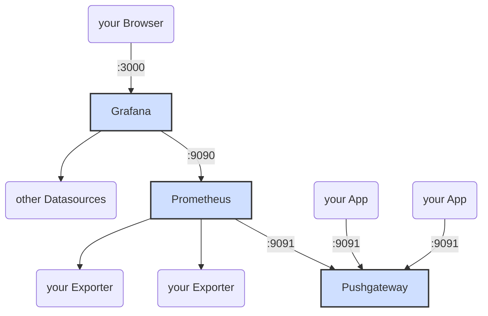

<script src="https://cdnjs.cloudflare.com/ajax/libs/mermaid/8.5.0/mermaid.min.js"></script>
<link rel="stylesheet" href="./mermaid.css">
<script>mermaid.initialize({startOnLoad:true});</script>

# prometheus-grafana-stack

## Start
```
docker-compose up
```

## Grafana
Grafana: [http://127.0.0.1:3000](http://127.0.0.1:3000)
Default-User/Passwort: admin/password

More Infos:
https://github.com/grafana/grafana
## Prometheus
Prometheus: [http://127.0.0.1:9090](http://127.0.0.1:9090)

More Infos:
https://github.com/prometheus/prometheus
## Prometheus Pushgateway
Pushgateway: [http://127.0.0.1:9091](http://127.0.0.1:9091)

Push a simple metric:
```
echo "some_metric 3.14" | curl --data-binary @- http://127.0.0.1:9091/metrics/job/some_job
```
More Infos:
https://github.com/prometheus/pushgateway

