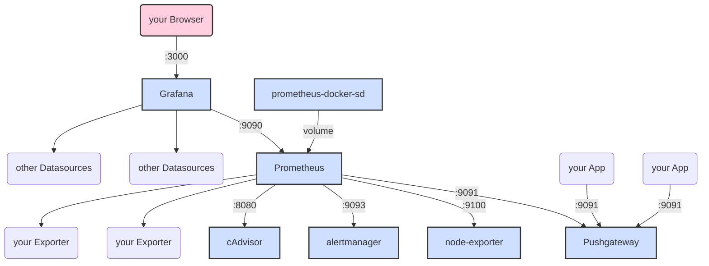

```mermaid
graph TD 
linkStyle default interpolate basis
Z(your Browser) -- :3000 --> A(Prometheus)
A[Grafana] -- :9090 --> B[Prometheus]
K[prometheus-docker-sd] -- volume --> B
A --> C(other Datasources)
A --> L(other Datasources)
B -- :9091 --> D[Pushgateway]
B -- :9100 --> I[node-exporter]
B -- :9093 --> M[alertmanager]
B -- :8080 --> J[cAdvisor]
B --> E(your Exporter)
B --> F(your Exporter)
G(your App) -- :9091 --> D
H(your App) -- :9091 --> D
style A fill:#cfdfff,stroke:#333,stroke-width:2px,top:40px
style B fill:#cfdfff,stroke:#333,stroke-width:2px
style D fill:#cfdfff,stroke:#333,stroke-width:2px
style I fill:#cfdfff,stroke:#333,stroke-width:2px
style J fill:#cfdfff,stroke:#333,stroke-width:2px
style K fill:#cfdfff,stroke:#333,stroke-width:2px
style M fill:#cfdfff,stroke:#333,stroke-width:2px
style Z fill:#ffcfdf,stroke:#333,stroke-width:2px
```
