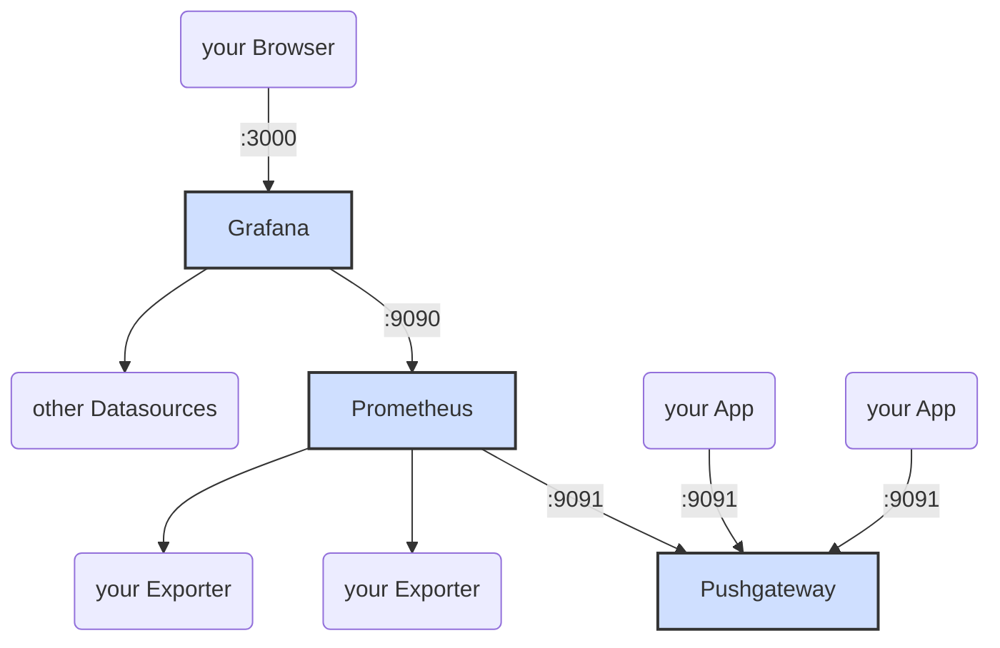

```mermaid
graph TD
Z(your Browser) -- :3000 --> A(Prometheus)
A[Grafana] -- :9090 --> B[Prometheus]
A --> C(other Datasources)
B -- :9091 --> D[Pushgateway]
B --> E(your Exporter)
B --> F(your Exporter)
G(your App) -- :9091 --> D
H(your App) -- :9091 --> D
style A fill:#cfdfff,stroke:#333,stroke-width:2px
style B fill:#cfdfff,stroke:#333,stroke-width:2px
style D fill:#cfdfff,stroke:#333,stroke-width:2px
```
